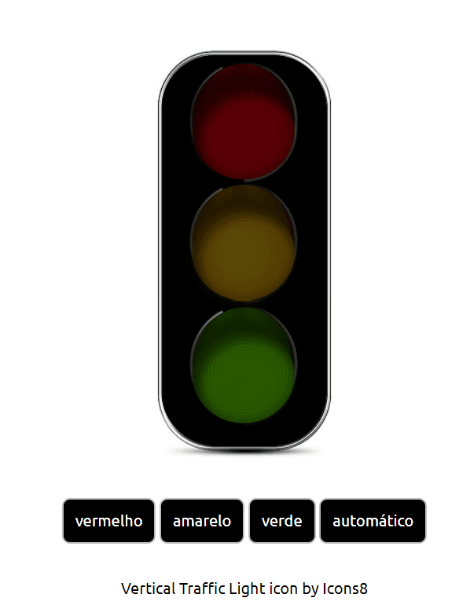

<h1 align="center">
  <p>Semaphore </p>
</h1>
<h2 align="center"><a href="https://wesley-wilson.github.io/snapclima/" target="_blank">access project</a></h2>



<br>

## 📕 About

**In this project** you can see the use of ternary, functions inside objects, calling functions dynamically and capturing the event in the object's parent.

<br>

## Buttons
**How to know which button the user clicked?**

trafficLight is a callback for the click event, thus being an argument of the event 
Thus receiving several properties, one of them being the interesting ( event.target.id )

to be more dynamic
Creating a literal object:
constant turnOn 
creating 3 functions: red,green and yellow with its image address. 
Then this function is passed to trafficLight in order to get the event, target and the target's id.


<br>

## Automatic
adiciona uma função chamada automatic dentro de **turOn**, logo depois a função automatic recebe o método setInterval -> que por sua vez recebe como parâmetro a função changeLight e seu tempo de repetição. 

função changeLight 
é criado um array de cores 
uma constante color recebendo o array de cores que por sua vez recebe uma variavel que armazena o número 0.
Indicando assim o index zero do ponto de partida inicial. 
seu nome é **colorIndex**
no fim pede a aplicação de **turnOn(color)();**
Para que as cores possam avançar uma após uma:
Criada função **nextIndex** ao qual recebe uma condicional composta em ternário -> se colorIndex < 2 então colorIndex recebe mais 1 senão colorIndex é igual a 0

Porém temos um último problema a resolver no quesito de incrementação :

pois o setInterval é ativado toda vez que o botão automatico é clicado, deixando cada vez mais rápido 
E por sua vez não para mesmo clicando em outro botão
precisa armazenar o id de setInterval numa variavel intervalId 

Para resolver isso criamos uma função para parar o processo
**breakAutomatic** que recebe a função **clearInterval** que recebe o parametro intervalId

```bash
automatic: () => intervalId = setInterval(changeLight, 1000)
```

<br>

 ## 🔨 Tools
 - [HTML](https://developer.mozilla.org/pt-BR/docs/Web/HTML)
 - [CSS](https://developer.mozilla.org/pt-BR/docs/Web/CSS)
- [SASS](https://sass-lang.com/guide)
- [Javascript](https://developer.mozilla.org/pt-BR/docs/Web/JavaScript)


<br>

## Fernando Leonid 
Professor Fernando Leonid's video channel to complement the remote classes.
- [Video](https://www.youtube.com/watch?v=EujFSEsZsk4&list=LL&index=9&t=1172s
)

## Thanks 
Picking up solid knowledge in the javascript language with the help of [Gustavo Guanabara](https://www.cursoemvideo.com/curso/javascript/), [Fernando Leonid](https://www.youtube.com/@FernandoLeonid) and other teachers who leave their free content on the internet.


